# Recipe for Rating: Predict Food Ratings using ML

This project predicts food ratings using machine learning techniques, developed as part of the MLP project from IITM. It achieved a top score of 0.78288 (Version 16) and ranked 118 in the Kaggle competition. The dataset was highly biased with ratings distributed as follows:

- Ratings of 1 and 2: ~1.3% each
- Ratings of 0 and 4: ~9.1% each
- Rating 5: 76.05%

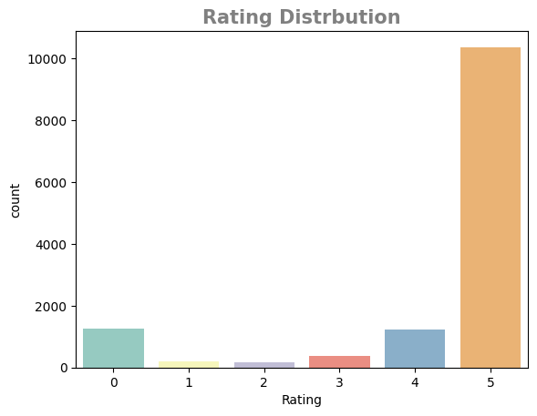

## Overview

The project involves predicting food ratings using various machine learning models. The approach includes data preprocessing, model training, and evaluation.

### Data Preprocessing

The preprocessing pipeline is designed to handle numeric, categorical, and text features.

1. **Numeric Features**:
   - Features like `RecipeNumber`, `BestScore`, `ThumbsUpCount`, and `ThumbsDownCount` are scaled using `StandardScaler` to ensure that they have a mean of 0 and a standard deviation of 1. This helps improve the performance of many machine learning algorithms.

2. **Categorical Features**:
   - Features such as `UserReputation` and `ReplyCount` are encoded using `OneHotEncoder`. This process converts categorical values into a one-hot numeric array, making it possible for the models to interpret them.

3. **Text Features**:
   - The `Recipe_Review` text feature is transformed using `TfidfVectorizer`. This vectorizer converts text data into numerical format by calculating term frequency-inverse document frequency (TF-IDF), which reflects the importance of words in the documents relative to the entire dataset.

These transformers are combined into a `ColumnTransformer` that applies the appropriate transformations to each feature type.

### Model Training

Various classifiers were used to predict food ratings, and their performance was evaluated:

1. **Logistic Regression**:
   - A logistic regression pipeline includes preprocessing followed by model fitting. It uses the `liblinear` solver and handles class imbalance with the `class_weight="balanced"` parameter.

2. **Random Forest**:
   - Random Forest classifiers are used with the `class_weight="balanced"` parameter to manage class imbalance. They are evaluated in a pipeline with preprocessing steps.

3. **SVM**:
   - Support Vector Machines (SVM) are included to classify the data. They are also managed in a pipeline with preprocessing steps.

4. **KNN**:
   - The K-Nearest Neighbors classifier is used to predict ratings based on the similarity between instances.

5. **AdaBoost**:
   - AdaBoost is used in conjunction with `DecisionTreeClassifier` to enhance model performance through boosting techniques.

6. **Balanced Bagging**:
   - This ensemble method is used to handle class imbalance by combining multiple base models and resampling the data.

7. **MLP**:
   - Multi-layer Perceptron (MLP) classifiers are employed to model complex relationships in the data.

### Model Comparison

Base models were compared based on accuracy, precision, and F1-score. Visual comparisons of these metrics are available:

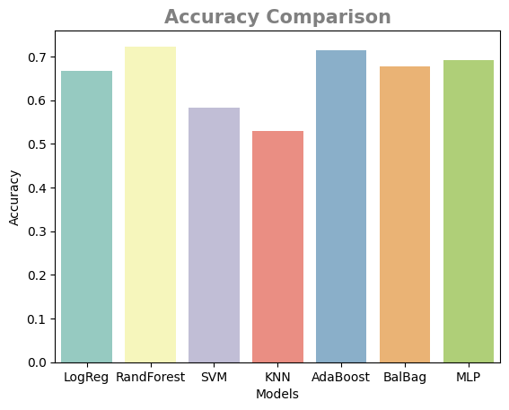
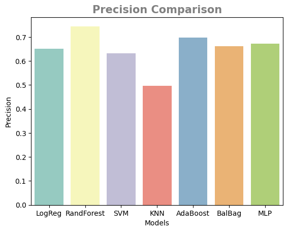
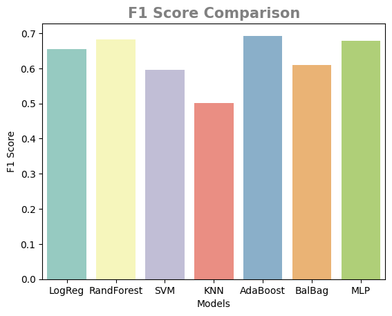

Further tuning was done using Randomized Search for the following models:

1. **Random Forest**
2. **Balanced Bagging**
3. **AdaBoost**
4. **MLP**

Each of these models was tuned with specific hyperparameters and evaluated:

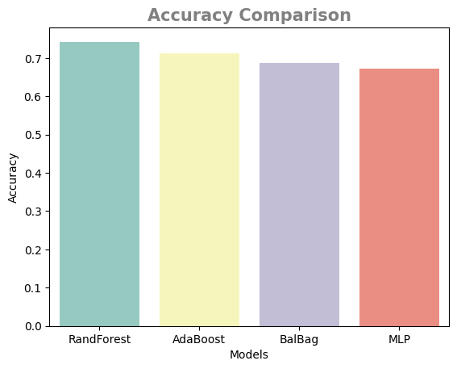
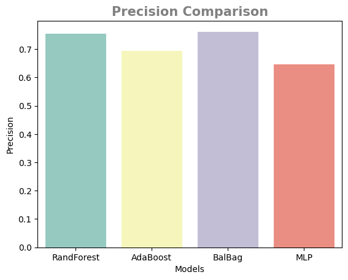
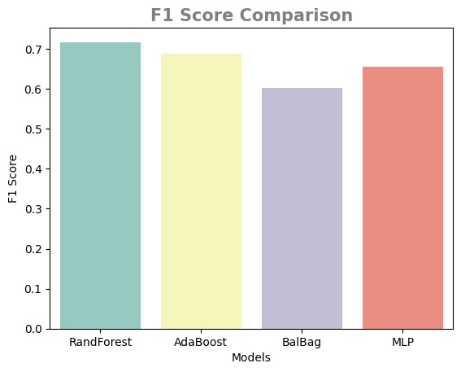

### Advanced Model Comparison

In the advanced model comparison, the focus was on evaluating the performance of two distinct models:

1. **Two-Stage Classification**:
   - **Model 1**: This model differentiates between rating 5 and all other ratings.
   - **Model 2**: This model classifies the remaining ratings (0, 1, 2, 3, 4) into their respective categories.

2. **Comparison of Model Performance**:
   - Models were compared based on their effectiveness in both classification stages.
   - Evaluation metrics include accuracy, precision, recall, and F1-score.
   - Visual representations of the comparison, including accuracy, precision, and F1-score, are provided.

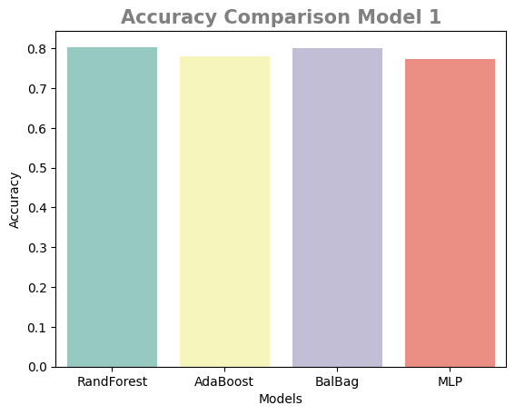
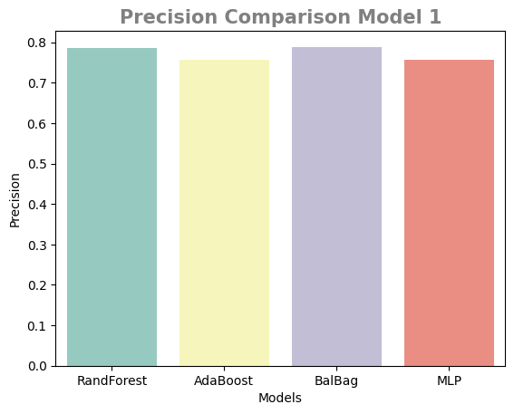
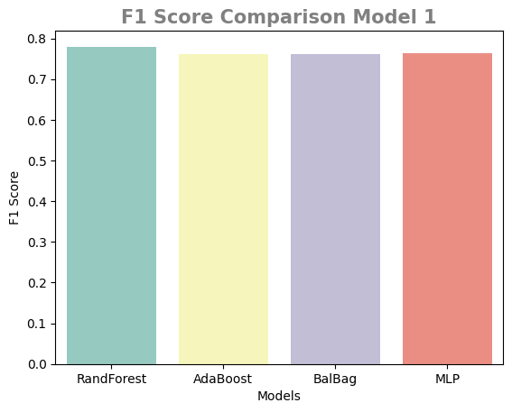

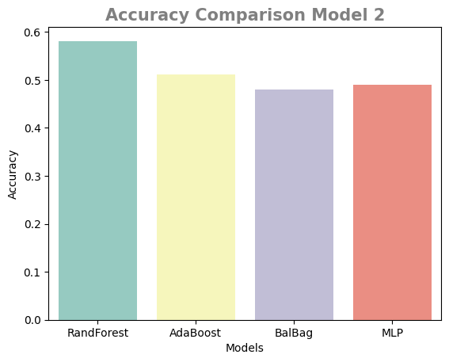

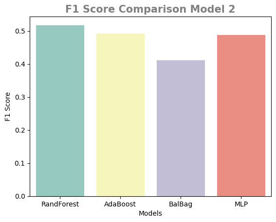

These comparisons illustrate how well each model performs in distinguishing between high ratings and other ratings, as well as classifying the other ratings into specific categories.

## Notebook

The detailed work for this project is documented and executed in a Jupyter notebook, which is available in this repository:

- [Recipe for Rating Notebook](21f3001823-notebook-t12024.ipynb)

Please note that the competition is private and therefore the notebook cannot be shared directly on Kaggle. However, the notebook is available in this repository for you to review.

The notebook includes:

- Data loading and preprocessing
- Model training and evaluation
- Results and visualizations

Feel free to explore the notebook for a comprehensive view of the project's methodology and outcomes.

## Instructions

1. **Load and Prepare Data**: Ensure the data is correctly formatted and loaded.
2. **Model Training**: Follow the provided code to train and evaluate models.
3. **Results**: Review the evaluation metrics and model comparisons.

## Contributing

Feel free to fork the repository, make improvements, or suggest enhancements. Contributions are welcome!

## License

This project is licensed under the MIT License. See the LICENSE file for more details.
